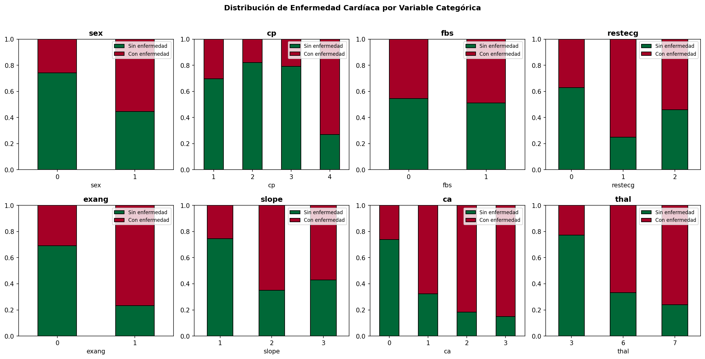
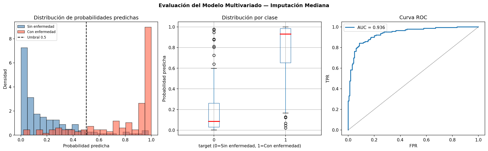
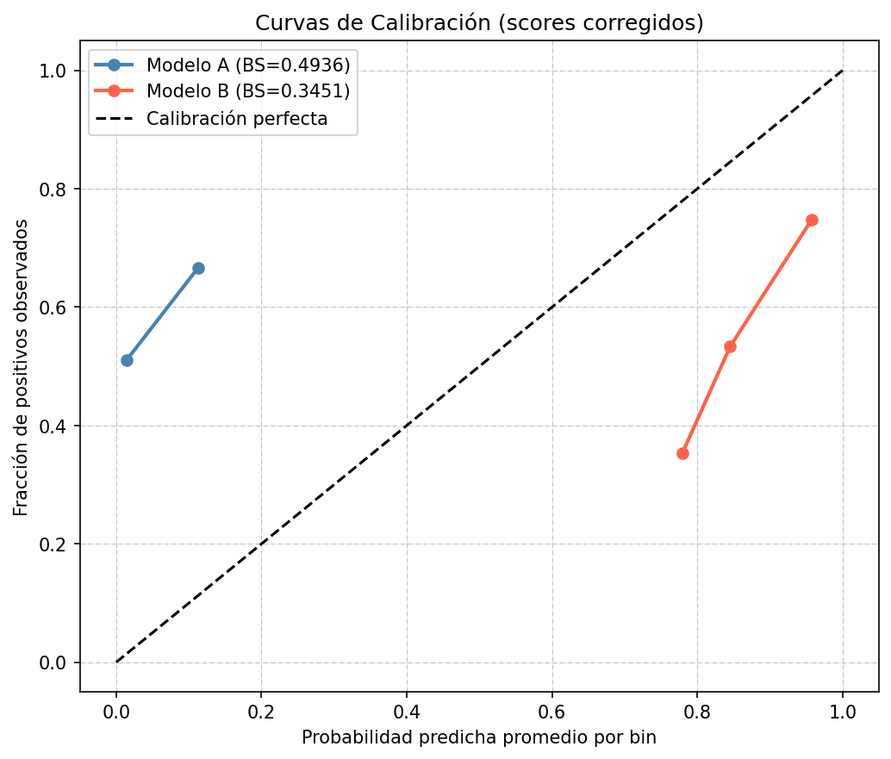
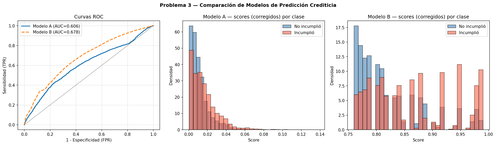
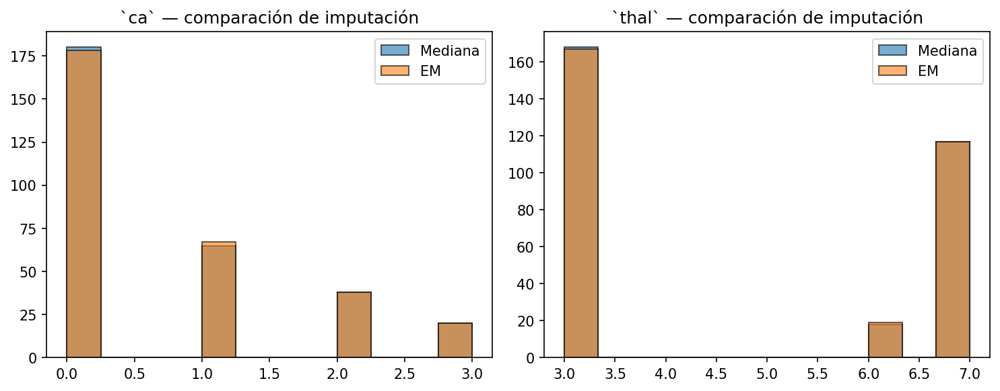
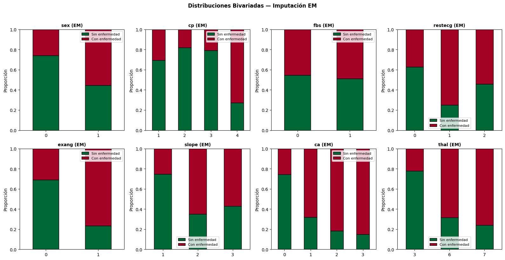
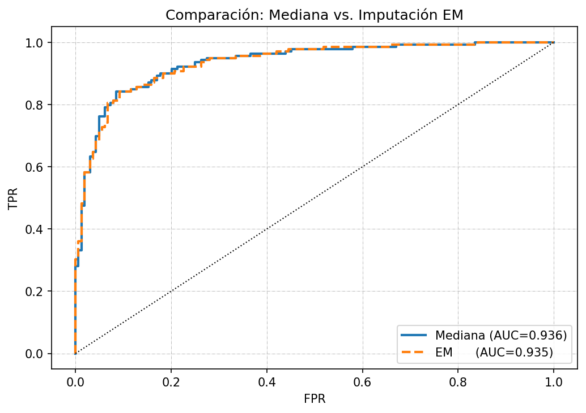

# Análisis Avanzado de Datos — Taller 03

**Autores:** Miguel Ángel Castelblanco García · Luis Gabriel Durán Fernández

Repositio [Taller 03](https://github.com/macastelblancog/MACC_Analisis_Datos_Avanzados/tree/main/TALLER03)
---
## Problema 1 — Familia Exponencial (20 pts)

Una familia de distribuciones $P_\theta$ pertenece a la **familia exponencial** si su función de masa/densidad puede escribirse como:

$$p(x|\theta) = h(x) \cdot \exp\!\bigl(\eta(\theta) \cdot t(x) - a(\theta)\bigr)$$

donde $h(x)$, $a(\theta)$ y $t(x)$ son funciones reales.

Demostraremos que **Bernoulli**, **Normal** y **Poisson** pertenecen a esta familia.

---

### 1.1 Distribución Bernoulli

Sea $X \sim \text{Bernoulli}(\pi)$, con $x \in \{0, 1\}$:

$$p(x|\pi) = \pi^x \cdot (1-\pi)^{1-x}$$

Tomando logaritmo y exponenciando:

$$p(x|\pi) = \exp\!\left(\log\!\left(\pi^x \cdot (1-\pi)^{1-x}\right)\right)$$

$$p(x|\pi) = \exp\!\left(x \cdot \log(\pi) + (1-x) \cdot \log(1-\pi)\right)$$

Agrupando términos

$$p(x|\pi) = \exp\!\left(x \cdot \left(\log(\pi) - \log(1-\pi)\right) + \log(1-\pi)\right)$$

$$p(x|\pi) = \exp\!\left(x \cdot \log\!\left(\frac{\pi}{1-\pi}\right) + \log(1-\pi)\right)$$

Identificando los componentes de la familia exponencial:

| Componente | Expresión |
|---|---|
| $h(x)$ | $1$ |
| $\eta(\theta)$ | $\log\!\left(\frac{\pi}{1-\pi}\right)$ (logit) |
| $t(x)$ | $x$ |
| $a(\theta)$ | $-\log(1-\pi) = \log(1+e^\eta)$ |

Por tanto, $\text{Bernoulli}(\pi)$ pertenece a la familia exponencial. 

**Conexión con regresión logística:** El parámetro natural $\eta = \log\!\left(\frac{\pi}{1-\pi}\right)$ es exactamente la función logit que se modela linealmente en la regresión logística: $\eta = \mathbf{x}^\top\boldsymbol{\beta}$.

---

### 1.2 Distribución Normal

Sea $X \sim \mathcal{N}(\mu, \sigma^2)$ con $\sigma^2$ conocido:

$$p(x|\mu) = \frac{1}{\sqrt{2 \cdot \pi \cdot\sigma^2}} \cdot \exp\!\left(-\frac{(x-\mu)^2}{2\sigma^2}\right)$$

Expandiendo el cuadrado en el exponente:

$$p(x|\mu) = \frac{1}{\sqrt{2\cdot\pi\cdot\sigma^2}} \cdot \exp\!\left(-\frac{x^2}{2\sigma^2}+ \frac{2\cdot\mu \cdot x}{2\cdot\sigma^2} - \frac{\mu^2}{2\sigma^2}\right)$$

Agrupando términos:

$$p(x|\mu) = \frac{1}{\sqrt{2\cdot\pi\cdot\sigma^2}} \cdot \exp\!\left(-\frac{x^2}{2\sigma^2}\right) \cdot \exp\!\left(\frac{\mu \cdot x}{\sigma^2} - \frac{\mu^2}{2\sigma^2}\right)$$

Identificando los componentes:

| Componente | Expresión |
|---|---|
| $h(x)$ | $\frac{1}{\sqrt{2\pi\sigma^2}}\exp\!\left(-\frac{x^2}{2\sigma^2}\right)$ |
| $\eta(\theta)$ | $\frac{\mu}{\sigma^2}$ |
| $t(x)$ | $x$ |
| $a(\theta)$ | $\frac{\mu^2}{2\sigma^2} = \frac{\eta^2\sigma^2}{2}$ |

Por tanto, $\mathcal{N}(\mu,\sigma^2)$ pertenece a la familia exponencial. 

**Conexión con regresión lineal:** El parámetro natural $\eta = \mu/\sigma^2$ es proporcional a la media condicional $E[Y|\mathbf{x}] = \mu = \mathbf{x}^\top\boldsymbol{\beta}$, función de enlace identidad.

---

### 1.3 Distribución Poisson

Sea $X \sim \text{Poisson}(\lambda)$, con $x \in \{0,1,2,\ldots\}$:

$$p(x|\lambda) = \frac{\lambda^x \cdot e^{-\lambda}}{x!}$$

Aplicando propiedades de logartímos

$$p(x|\lambda) = \frac{1}{x!} \cdot \exp\!\bigl( \log(\lambda^x)\bigr) \cdot \exp(-\lambda) $$

$$p(x|\lambda) = \frac{1}{x!} \cdot \exp\!\bigl(x \cdot \log(\lambda)\bigr) \cdot \exp(-\lambda) $$

$$p(x|\lambda) = \frac{1}{x!} \cdot \exp\!\bigl(x \cdot \log(\lambda) - \lambda\bigr)$$

Identificando los componentes:

| Componente | Expresión |
|---|---|
| $h(x)$ | $\frac{1}{x!}$ |
| $\eta(\theta)$ | $\log(\lambda)$ (log-link) |
| $t(x)$ | $x$ |
| $a(\theta)$ | $\lambda = e^\eta$ |

Por tanto, $\text{Poisson}(\lambda)$ pertenece a la familia exponencial. 

**Conexión con regresión Poisson:** El parámetro natural $\eta = \log(\lambda)$ es la función de enlace log: $\log E[Y|\mathbf{x}] = \mathbf{x}^\top\boldsymbol{\beta}$.

---
## Problema 2 — Regresión Logística: Heart Disease UCI (50 pts)

**Dataset:** [Processed Cleveland Heart Disease](http://archive.ics.uci.edu/ml/machine-learning-databases/heart-disease/processed.cleveland.data)

### Variables

| # | Variable | Tipo | Descripción |
|---|---|---|---|
| 1 | `age` | Continua | Edad en años |
| 2 | `sex` | Binaria | 1=hombre, 0=mujer |
| 3 | `cp` | Categórica | Tipo de dolor de pecho (1–4) |
| 4 | `trestbps` | Continua | Presión arterial en reposo (mmHg) |
| 5 | `chol` | Continua | Colesterol sérico (mg/dl) |
| 6 | `fbs` | Binaria | Glucemia en ayunas >120 mg/dl (1=sí, 0=no) |
| 7 | `restecg` | Categórica | Resultados ECG en reposo (0–2) |
| 8 | `thalach` | Continua | Frecuencia cardíaca máxima alcanzada |
| 9 | `exang` | Binaria | Angina inducida por ejercicio (1=sí, 0=no) |
| 10 | `oldpeak` | Continua | Depresión ST inducida por ejercicio |
| 11 | `slope` | Categórica | Pendiente del segmento ST máximo (1–3) |
| 12 | `ca` | Ordinal | N° de vasos principales coloreados (0–3) |
| 13 | `thal` | Categórica | Tipo de defecto talámico (3,6,7) |
| 14 | `target` | **Respuesta** | Diagnóstico (0=no enfermedad; 1–4 → binarizar a 1) |

### Información del DataSet

Dimensiones: 303 filas × 14 columnas

Valores faltantes por variable:

| # | Variable | Cantidad |
|--|---|---|
| 1 | `ca` | 4 |
| 2 | `thal` | 2 |

Los valores faltantes fueron imputados con su mediana.

> **Proporción de enfermedad:** 0.459

### Distribuciones Bivariadas

Se encontró que variables como `exang`, `ca`, `thal` y `cp` tienen categorías donde las poblaciones presentan mayores proporciones de individuos con valores positivos en la variable objetivo.

### Tablas de Contingencia

Se identificaron dos inconvenientes concretos:

1. **`restecg = 1`** tiene solo **4 observaciones** (1 sin enfermedad, 3 con enfermedad), lo que genera estimadores inestables con errores estándar muy grandes.
2. **`fbs`** muestra distribuciones de la variable objetivo casi idénticas entre sus categorías (≈ 50:50), con una diferencia de solo **3.6 pp** (45.3% vs 48.9%).

---

#### restecg

| restecg | target = 0 | target = 1 | Total |
|---|---:|---:|---:|
| 0 | 95 | 56 | 151 |
| 1 | 1 | 3 | 4 |
| 2 | 68 | 80 | 148 |
| **Total** | **164** | **139** | **303** |

Por otro lado `ca` y `thal` tienen categorías donde las combinaciones con valores negativos de la variable objetivo son pocas, aunque la categoría en general es representativa.

---

#### ca

| ca | target = 0 | target = 1 | Total |
|---|---:|---:|---:|
| 0 | 133 | 47 | 180 |
| 1 | 21 | 44 | 65 |
| 2 | 7 | 31 | 38 |
| 3 | 3 | 17 | 20 |
| **Total** | **164** | **139** | **303** |

---

#### thal

| thal | target = 0 | target = 1 | Total |
|---|---:|---:|---:|
| 3 | 130 | 38 | 168 |
| 6 | 6 | 12 | 18 |
| 7 | 28 | 89 | 117 |
| **Total** | **164** | **139** | **303** |

La variable `fbs` tiene distribuciones de la variable objetivo muy parecidas entre sus categorías (cerca de 50:50):

#### fbs

| fbs | target = 0 | target = 1 | Total |
|---|---:|---:|---:|
| 0 | 141 | 117 | 258 |
| 1 | 23 | 22 | 45 |
| **Total** | **164** | **139** | **303** |

### Modelo bivariado con `fbs`

#### Interpretación de $\hat{\beta}_0 = -0.1866$

$\hat{\beta}_0$ es el log-odds de tener enfermedad cardíaca cuando `fbs = 0` (glucemia en ayunas normal):

$$\text{odds}(\text{enfermedad} \mid \text{fbs}=0) = e^{\hat{\beta}_0} = e^{-0.1866} = 0.8298$$

Es decir, por cada paciente con glucemia normal que **tiene** enfermedad cardíaca hay 0.83 que **no la tienen** — una odds prácticamente de 1:1, consistente con $\hat{\pi}(\text{fbs}=0) = 45.4\%$.

#### Interpretación de $\hat{\beta}_1 = 0.1421$ (OR = 1.1527)

$\hat{\beta}_1 = \log(\widehat{OR})$ cuantifica el cambio en log-odds al pasar de `fbs = 0` a `fbs = 1`:

$$\widehat{OR} = e^{0.1421} = 1.1527$$

Tener glucemia en ayunas elevada multiplica las odds de enfermedad cardíaca por **1.15** — un incremento del 15% que equivale a solo **3.5 pp** de diferencia en probabilidad (45.4% → 48.9%). `fbs` prácticamente **no discrimina** la presencia de enfermedad.

#### Significancia estadística

$$SE(\hat{\beta}_1) \approx \sqrt{\frac{1}{n_{11}} + \frac{1}{n_{10}} + \frac{1}{n_{01}} + \frac{1}{n_{00}}} = \sqrt{\frac{1}{22}+\frac{1}{23}+\frac{1}{117}+\frac{1}{141}} \approx 0.323$$

$$z_{\text{Wald}} = \frac{0.1421}{0.323} \approx 0.44 \quad \Rightarrow \quad p \approx 0.66$$

> **`fbs` no es estadísticamente significativa** al nivel 5%. El IC 95% del OR incluye holgadamente el valor 1, lo que confirma que no hay evidencia de asociación entre glucemia en ayunas elevada y la presencia de enfermedad cardíaca en esta muestra. Este resultado se mantiene en el modelo multivariado (p ≈ 0.50 según el test de Wald).

### Modelo Multivariado — Regresión Logística (GLM Binomial)

| Estadístico | Valor |
|---|---|
| Observaciones | 303 |
| Log-verosimilitud | -97.431 |
| Devianza | 194.863 |
| Pseudo R² McFadden | 0.5338 |
| Pseudo R² Cox-Snell | 0.5212 |

#### Test de Wald — coeficientes e intervalos de confianza

Evaluamos la hipótesis nula de que la variable $j$ no aporte información para la predicción de la variable respuesta:

$$z_{j} = \frac{\hat{\beta}_{j}}{SE(\hat{\beta}_{j})} \xrightarrow{H_{0}} \mathcal{N}(0,1)$$

|                 |    Coef |     SE |       z |   p-valor |     OR |   IC 95% inf |   IC 95% sup | Sig.   |
|:----------------|--------:|-------:|--------:|----------:|-------:|-------------:|-------------:|:-------|
| Intercept       | -6.1119 | 2.8867 | -2.1170 |    0.0342 | 0.0022 |       0.0000 |       0.6350 | *      |
| C(cp)[T.2]      |  1.1616 | 0.7633 |  1.5220 |    0.1281 | 3.1951 |       0.7157 |      14.2633 |        |
| C(cp)[T.3]      |  0.2401 | 0.6592 |  0.3640 |    0.7156 | 1.2714 |       0.3493 |       4.6276 |        |
| C(cp)[T.4]      |  2.1555 | 0.6635 |  3.2490 |    0.0012 | 8.6323 |       2.3517 |      31.6868 | **     |
| C(restecg)[T.1] |  0.8340 | 2.4987 |  0.3340 |    0.7385 | 2.3026 |       0.0172 |     308.4197 |        |
| C(restecg)[T.2] |  0.4737 | 0.3797 |  1.2480 |    0.2122 | 1.6060 |       0.7630 |       3.3804 |        |
| C(slope)[T.2]   |  1.1544 | 0.4665 |  2.4750 |    0.0133 | 3.1720 |       1.2713 |       7.9143 | *      |
| C(slope)[T.3]   |  0.4961 | 0.9269 |  0.5350 |    0.5925 | 1.6422 |       0.2670 |      10.1029 |        |
| C(thal)[T.6]    | -0.1045 | 0.7850 | -0.1330 |    0.8941 | 0.9008 |       0.1934 |       4.1962 |        |
| C(thal)[T.7]    |  1.3085 | 0.4187 |  3.1250 |    0.0018 | 3.7008 |       1.6290 |       8.4076 | **     |
| age             | -0.0148 | 0.0247 | -0.6000 |    0.5487 | 0.9853 |       0.9386 |       1.0342 |        |
| sex             |  1.5723 | 0.5290 |  2.9720 |    0.0030 | 4.8175 |       1.7083 |      13.5859 | **     |
| trestbps        |  0.0242 | 0.0112 |  2.1550 |    0.0312 | 1.0245 |       1.0022 |       1.0473 | *      |
| chol            |  0.0044 | 0.0040 |  1.1060 |    0.2686 | 1.0044 |       0.9966 |       1.0124 |        |
| fbs             | -0.3934 | 0.5788 | -0.6800 |    0.4967 | 0.6748 |       0.2170 |       2.0981 |        |
| thalach         | -0.0169 | 0.0111 | -1.5260 |    0.1271 | 0.9832 |       0.9621 |       1.0048 |        |
| exang           |  0.7784 | 0.4370 |  1.7810 |    0.0749 | 2.1779 |       0.9249 |       5.1284 | ·      |
| oldpeak         |  0.3676 | 0.2305 |  1.5950 |    0.1108 | 1.4442 |       0.9192 |       2.2691 |        |
| ca              |  1.2958 | 0.2774 |  4.6710 |    0.0000 | 3.6539 |       2.1215 |       6.2932 | ***    |

`***` p<0.001 · `**` p<0.01 · `*` p<0.05 · `·` p<0.10

Las variables estadísticamente significativas (p < 0.05) en el modelo multivariado son: el número de vasos coloreados por fluoroscopía (`ca`), el tipo de dolor de pecho severo (`cp = 4`), el defecto talámico reversible (`thal = 7`), el sexo (`sex`), la presión arterial en reposo (`trestbps`) y la pendiente plana del segmento ST (`slope = 2`).

### Probabilidades predichas

Las distribuciones de probabilidad predicha están claramente separadas entre clases: los pacientes sin enfermedad se concentran en probabilidades bajas y los enfermos en probabilidades altas. El AUC (≈ 0.936) y la exactitud (≈ 87%) indican que el modelo describe bien la presencia de enfermedad cardíaca.

No obstante, existe una zona intermedia (probabilidades ≈ 0.5) con cierto solapamiento, donde el modelo es menos certero. Esto es esperable: el diagnóstico depende de factores no recogidos en estas 13 variables. En conjunto, el modelo es adecuado como herramienta de tamizaje del riesgo cardíaco.

| Métrica | Valor |
|---|---|
| AUC-ROC | **0.9356** |
| Accuracy (umbral 0.5) | **0.8713** |

---
## Problema 3 — Comparación de modelos de predicción crediticia (20 pts)

El archivo `AAD-taller03.xlsx` contiene predicciones de dos modelos para 9.080 clientes y la variable observada de incumplimiento real al final del periodo.

**Objetivo:** Determinar cuál modelo tiene **mayor poder de predicción** con fundamento estadístico.

| # | Variable | Tipo | Descripción |
|---|---|---|---|
| 1 | `Incumplimiento` | Binaria | Si hubo incumplimiento (0/1) |
| 2 | `ScoreLogisticoA` | Continua | Score modelo A — probabilidades en [0, 0.14] |
| 3 | `ScoreLogisticoB` | Continua | Score modelo B — **orientación invertida**, corregido con $1 - \text{score}$ |

> `ScoreLogisticoB` venía orientado inversamente (AUC directo = 0.3221 < 0.5), lo que indica que un score alto correspondía a **menor** riesgo. Se corrigió con la transformación $1 - \text{scoreB}$, que invierte la orientación manteniendo los valores en $[0, 1]$.

### Comparación de métricas

| Métrica | Modelo A | Modelo B | Mejor |
|---|---:|---:|:---:|
| AUC *(↑ mejor)* | 0.6060 | 0.6779 | **B** ✓ |
| Brier Score *(↓ mejor)* | 0.4936 | 0.3451 | **B** ✓ |
| KS Statistic *(↑ mejor)* | 0.1915 | 0.2624 | **B** ✓ |
| p-valor KS | 3.2438e-73 | 8.3937e-138 | — |

### Curvas de calibración

Las curvas de calibración evalúan si las probabilidades predichas están alineadas con las frecuencias observadas. Un Brier Score menor indica mejor calibración.

### Test de DeLong

| | Modelo A | Modelo B |
|---|---:|---:|
| AUC | 0.6060 | 0.6779 |
| IC 95% (bootstrap) | [0.5947, 0.6170] | [0.6663, 0.6886] |
| Delta AUC (A − B) | −0.0718 | — |
| *z*-statistic | −8.4336 | — |
| p-valor DeLong | < 0.001 | — |

> **Conclusión** (α = 0.05): Se rechaza $H_0$. **Modelo B** presenta significativamente mayor poder predictivo (AUC = 0.6779, p < 0.001).

### Comparación visual

### Conclusión

La diferencia de AUC (≈ 0.072 puntos) es estadísticamente significativa según el test de DeLong (p < 0.001). El **Modelo B discrimina mejor** entre clientes que incumplirán y los que no, independientemente del umbral de clasificación elegido. El Brier Score confirma que B también está mejor calibrado.

---
## Problema 4 — Regresión Logística con Imputación EM (10 pts)

Repetir el Problema 2 usando **algoritmo EM (Expectation-Maximization)** para imputar los datos faltantes en lugar de la mediana.

En Python, `sklearn.impute.IterativeImputer` implementa un algoritmo tipo MICE que bajo distribuciones normales converge al estimador EM. Es la alternativa práctica estándar al EM puro para datos mixtos.

### Fundamento teórico del EM para datos faltantes

Bajo el supuesto MAR (*Missing At Random*), el algoritmo EM itera entre:
- **E-step:** Calcular $Q(\theta | \theta^{(t)}) = E[\log p(X_{obs}, X_{mis}|\theta) \mid X_{obs}, \theta^{(t)}]$
- **M-step:** Maximizar $Q$ respecto a $\theta$: $\theta^{(t+1)} = \arg\max_\theta Q(\theta|\theta^{(t)})$

Para datos normales multivariados, el EM produce imputaciones óptimas en varianza.

### Comparación de imputaciones

### Distribuciones bivariadas (imputación EM)

### Comparación Wald: Mediana vs EM

La siguiente tabla muestra los coeficientes y significancia de cada variable bajo ambos métodos de imputación, permitiendo identificar si alguna variable cambia de significancia.

> Los resultados son prácticamente idénticos dado que solo el 2% de los valores (6/303) eran faltantes.

### Comparación final: Mediana vs EM

| Métrica | Mediana | EM | Mejor |
|---|---:|---:|:---:|
| AUC-ROC *(↑)* | 0.9356 | 0.9359 | **EM** |
| Brier Score *(↓)* | 0.0975 | 0.0976 | **Mediana** |

### Conclusión

La imputación EM y la imputación por mediana producen resultados prácticamente idénticos. Esto es esperable: solo 6 de 303 valores (2%) eran faltantes, por lo que el método de imputación tiene impacto mínimo sobre el modelo.

Las variables significativas al 5% son las mismas en ambos enfoques. El AUC y el Brier Score difieren en menos de 0.001 puntos.

Desde una perspectiva estadística:
- La **mediana** es válida bajo **MCAR** (*Missing Completely At Random*): los faltantes no dependen de ninguna variable.
- El **EM** es válido bajo **MAR** (*Missing At Random*): los faltantes pueden depender de variables observadas. Es el supuesto más razonable en la práctica y hace al EM preferible cuando la proporción de faltantes es mayor.

---

# Anexos

## Tablas de contingencia completas

#### sex

| sex | target = 0 | target = 1 | Total |
|---|---:|---:|---:|
| 0 | 72 | 25 | 97 |
| 1 | 92 | 114 | 206 |
| **Total** | **164** | **139** | **303** |

---

#### cp

| cp | target = 0 | target = 1 | Total |
|---|---:|---:|---:|
| 1 | 16 | 7 | 23 |
| 2 | 41 | 9 | 50 |
| 3 | 68 | 18 | 86 |
| 4 | 39 | 105 | 144 |
| **Total** | **164** | **139** | **303** |

---

#### fbs

| fbs | target = 0 | target = 1 | Total |
|---|---:|---:|---:|
| 0 | 141 | 117 | 258 |
| 1 | 23 | 22 | 45 |
| **Total** | **164** | **139** | **303** |

---

#### restecg

| restecg | target = 0 | target = 1 | Total |
|---|---:|---:|---:|
| 0 | 95 | 56 | 151 |
| 1 | 1 | 3 | 4 |
| 2 | 68 | 80 | 148 |
| **Total** | **164** | **139** | **303** |

---

#### exang

| exang | target = 0 | target = 1 | Total |
|---|---:|---:|---:|
| 0 | 141 | 63 | 204 |
| 1 | 23 | 76 | 99 |
| **Total** | **164** | **139** | **303** |

---

#### slope

| slope | target = 0 | target = 1 | Total |
|---|---:|---:|---:|
| 1 | 106 | 36 | 142 |
| 2 | 49 | 91 | 140 |
| 3 | 9 | 12 | 21 |
| **Total** | **164** | **139** | **303** |

---

#### ca

| ca | target = 0 | target = 1 | Total |
|---|---:|---:|---:|
| 0 | 133 | 47 | 180 |
| 1 | 21 | 44 | 65 |
| 2 | 7 | 31 | 38 |
| 3 | 3 | 17 | 20 |
| **Total** | **164** | **139** | **303** |

---

#### thal

| thal | target = 0 | target = 1 | Total |
|---|---:|---:|---:|
| 3 | 130 | 38 | 168 |
| 6 | 6 | 12 | 18 |
| 7 | 28 | 89 | 117 |
| **Total** | **164** | **139** | **303** |